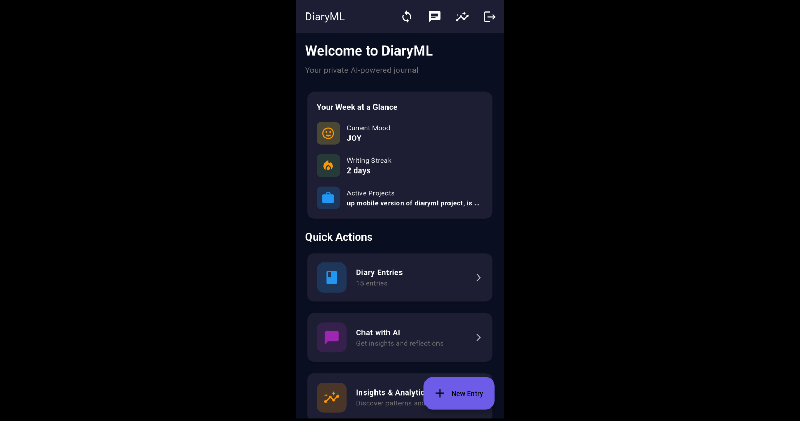

# DiaryML


[](https://github.com/wedsmoker/DiaryML/releases)


**Private, encrypted AI journaling with emotion detection and deep insights. Zero surveillance, zero tracking, 100% local.**

| Desktop/Web Interface | Mobile App |
|:--:|:--:|
|  | [](mobile_app/README.md) |
| Full-featured web interface | [Mobile companion app](mobile_app/README.md) with offline sync |

## ✨ Features

- 🔒 **AES-256 Encrypted** - SQLCipher database, zero cloud dependencies
- 🧠 **Local AI** - Any GGUF model (1B-3B optimized), CPU-only, hotswappable
- 😊 **Emotion Detection** - Calibrated AI analyzes 6 emotions with conversational awareness
- 📊 **Deep Analytics** - Writing streaks, productivity scores, temporal patterns
- 💬 **Chat Sessions** - Multiple conversations with AI, full history
- 🔍 **Advanced Search** - Full-text, date range, emotion filters, RAG semantic search
- ✏️ **Entry Editing** - Edit past entries with emotion re-analysis
- 💾 **Backup/Restore** - One-click zip backup
- 🔊 **Voice Output** - Browser TTS for AI responses
- 📱 **Mobile App** - Flutter app with offline sync ([see mobile app](mobile_app/README.md))

## 🚀 Quick Start

**Note:** `pysqlcipher3` is required for encryption. Without it, your database will NOT be encrypted!

### Option 1: Docker (Recommended - Easiest!)

```bash
# 1. Download a GGUF model to models/ directory
# 2. Build and run with Docker Compose
docker-compose up -d

# 3. Open http://localhost:8000 and set your password
```

**Docker Benefits:**
- ✅ No dependency hell - everything bundled
- ✅ Consistent environment across platforms
- ✅ Easy updates with `docker-compose pull && docker-compose up -d`
- ✅ Data persists in volumes (diary.db, models/, chroma_db/)

### Option 2: Manual Installation

1. **Install:** `pip install -r requirements.txt`
2. **Get a Model:** Download any GGUF model (1-3B recommended) to `models/`
3. **Run:** Windows: `start.bat` | Linux/macOS: `./start.sh`
4. **Open:** Navigate to `http://localhost:8000` and set your password

## 🧠 Supported Models

Works with **any GGUF model** - optimized for 1-3B on CPU:
- **1B** (fastest) - 2k tokens, 24k context
- **2B** (balanced) - 3k tokens, 28k context
- **3B** (quality) - 4k tokens, 32k context
- Auto-detects thinking models (`<think>` tags) and vision models

## 🔧 Tech Stack

FastAPI + SQLCipher + llama.cpp + ChromaDB + Hugging Face transformers

## 🔐 Why DiaryML?

**Surveillance-Free & Private:**
- ✅ **Zero tracking** - No telemetry, no analytics, no phone-home
- ✅ **Zero cloud** - Everything runs locally on your machine
- ✅ **Zero accounts** - No sign-ups, no services, no third parties
- ✅ **AES-256 encrypted** - SQLCipher database secured with your password
- ✅ **Open source** - Audit the code, know exactly what it does

**Easy to Use:**
- ✅ One command with Docker (`docker-compose up -d`)
- ✅ Or simple scripts (`start.bat` / `start.sh`)
- ✅ Works on any platform (Windows, Linux, macOS)
- ✅ No GPU required - runs on CPU only

**Easy to Modify:**
- ✅ Simple Python codebase (FastAPI backend)
- ✅ Vanilla JavaScript frontend (no complex frameworks)
- ✅ Well-documented API endpoints
- ✅ MIT licensed - modify freely

⚠️ **Important:** Requires `pysqlcipher3` for encryption. Without it, data is unencrypted!

## 📦 Requirements

- Python 3.10+ | 2-4GB RAM | ~1-3GB disk | **No GPU required**
- Keyboard shortcuts: `Ctrl+F` (search), `Ctrl+S` (save), `Ctrl+L` (lock), `Esc` (close)

## 🐛 Troubleshooting

- **Model not loading?** Check `models/` folder for valid GGUF file
- **Slow responses?** Use smaller 1B model or Q4_K_M quantization
- **Can't unlock?** First password creates DB; delete `diary.db` to reset
- **ChromaDB error?** Delete `chroma_db/` folder, auto-rebuilds on restart

## 📄 License

MIT License - use freely, modify, share.

## 🙏 Credits

Built with FastAPI, ChromaDB, llama.cpp, sentence-transformers, and Hugging Face transformers.

---

**DiaryML**: Your private creative companion. Capture emotions that words cannot express.
