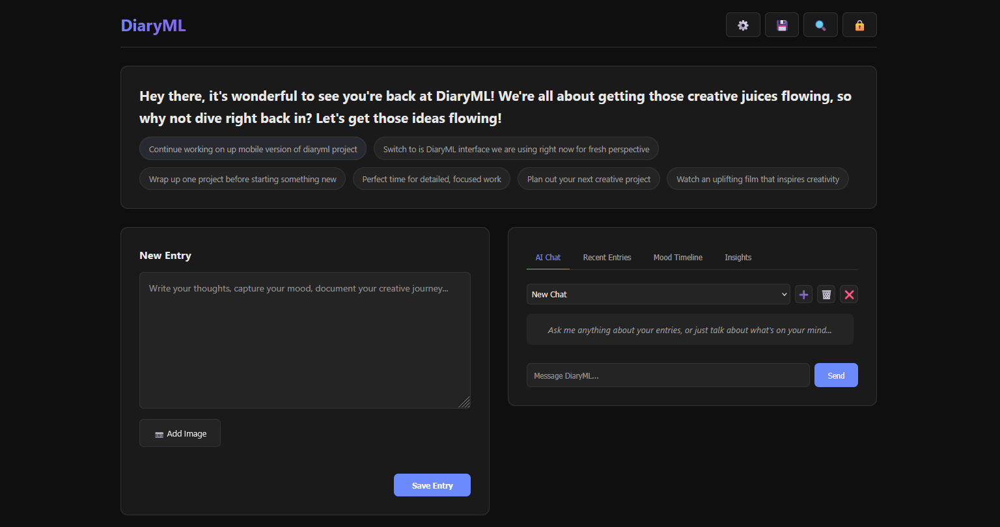

# DiaryML


**Private AI journaling with emotion detection, temporal analytics, and deep insights—100% offline.**



## ✨ Features

| Feature | Description |
|---------|-------------|
| 🔒 **AES-256 Encrypted** | SQLCipher database encryption, zero cloud dependencies |
| 🧠 **Local AI** | Any GGUF model (1B-3B optimized), CPU-only, hotswappable |
| 😊 **Professional Emotion Detection** | Calibrated AI analyzes 6 emotions with conversational awareness |
| 📊 **Deep Analytics** | Writing streaks, productivity scores, temporal patterns |
| 💬 **Chat Management** | Multiple sessions, full history, timestamps |
| 🔍 **Advanced Search** | Full-text, date range, emotion filters |
| ✏️ **Entry Editing** | Edit past entries with history tracking |
| 💾 **Backup/Restore** | One-click zip backup of everything |
| 🔊 **Voice Output** | Browser TTS for AI responses |
| ⚡ **Model Hotswap** | Switch AI models without restarting |
| 📈 **Pattern Detection** | Track projects, moods, creative rhythms |
| 🎯 **RAG Search** | Semantic search across all entries |

## 📦 Installation

### 1. Install Dependencies

```bash
pip install -r requirements.txt
```

**Important:** `pysqlcipher3` is required for database encryption. If installation fails on Windows, you may need to:
- Install Visual C++ Build Tools
- Or use a precompiled wheel from [Python packages](https://www.lfd.uci.edu/~gohlke/pythonlibs/)

⚠️ **Without pysqlcipher3**, the database will NOT be encrypted and data will be human-readable!

## 🚀 Quick Start

### Option 1: Docker (Recommended - Easiest!)

```bash
# 1. Download a GGUF model to models/ directory
# 2. Build and run with Docker Compose
docker-compose up -d

# 3. Open http://localhost:8000 and set your password
```

**Docker Benefits:**
- ✅ No dependency hell - everything bundled
- ✅ Consistent environment across platforms
- ✅ Easy updates with `docker-compose pull && docker-compose up -d`
- ✅ Data persists in volumes (diary.db, models/, chroma_db/)

### Option 2: Manual Installation

**1. Get a Model**

Download any GGUF model (1-3B recommended) to `models/`:

```bash
# Example: nsfw-ameba-3.2-1b-q5_k_m.gguf (fast on CPU)
# Or any other GGUF from HuggingFace
```

**2. Run**

**Windows:**
```bash
start.bat
```

**macOS/Linux:**
```bash
chmod +x start.sh && ./start.sh
```

**3. Open**

Navigate to `http://localhost:8000` and set your password.

## 🎯 What's New

- ✅ **Docker Support**: One-command deployment with docker-compose
- ✅ **Professional Emotion Detection**: Calibrated with conversational awareness (no more 98% anger!)
- ✅ **<think> Tag Support**: Qwen MOE and reasoning models properly cleaned
- ✅ **6-8x Larger Response Tokens**: 2k-4k tokens (no more cutoffs!)
- ✅ **Chat Sessions**: Save, view, delete multiple chat conversations
- ✅ **Writing Streaks**: Track daily writing habits and productivity
- ✅ **Temporal Analytics**: Mood trends, weekly patterns, project insights
- ✅ **Model Hotswapping**: Switch models from UI, persists across restarts
- ✅ **Smart AI**: Auto-detects model size, quantization, thinking models
- ✅ **Keyboard Shortcuts**: Ctrl+F (search), Ctrl+S (save), Ctrl+L (lock), Esc (close)
- ✅ **Entry Search**: Full-text, date range, emotion filtering
- ✅ **Backup System**: Download complete diary backup as zip

## 📖 API Endpoints

| Endpoint | Description |
|----------|-------------|
| `POST /api/unlock` | Unlock diary with password |
| `POST /api/chat` | Chat with AI (session-based) |
| `GET /api/chat/sessions` | List all chat sessions |
| `POST /api/chat/sessions` | Create new chat |
| `DELETE /api/chat/sessions/{id}` | Delete chat session |
| `GET /api/entries` | Get entries (with filters) |
| `POST /api/entries` | Create new entry |
| `PUT /api/entries/{id}` | Edit entry |
| `DELETE /api/entries/{id}` | Delete entry |
| `GET /api/search` | Search entries |
| `GET /api/analytics/comprehensive` | All analytics |
| `GET /api/analytics/streak` | Writing streak data |
| `GET /api/analytics/productivity` | Creativity score |
| `GET /api/models/list` | List available models |
| `POST /api/models/switch` | Hot-swap AI model |
| `GET /api/backup` | Download backup zip |

## 🧠 Supported Models

DiaryML works with **any GGUF model** but is optimized for 1-3B models on CPU:

### Text-Only Models (Recommended for CPU)
- ✅ **1B models** (fastest): `nsfw-ameba-3.2-1b-q5_k_m.gguf`
- ✅ **2B models** (balanced): Any Qwen/Llama 2B GGUF, Qwen3-MOE models
- ✅ **3B models** (quality): `AI21-Jamba-Reasoning-3B-Q4_K_M.gguf`
- ✅ **Thinking models**: Auto-detected and cleaned (supports `<think>`, `<output>`, reasoning tags)
- ✅ **Context windows**: Large contexts for rich history (1B→24k, 2B→28k, 3B→32k tokens)
- ✅ **Response tokens**: Generous limits (1B→2k, 2B→3k, 3B→4k+) - no more cutoffs!

### Vision-Language Models (Experimental)
- ✅ **Vision models**: Automatically detect VL models (e.g., `LFM2-VL`, `Qwen-VL`)
- ✅ **Image support**: Requires `mmproj-model-f16.gguf` in models folder
- ✅ **Auto-detection**: DiaryML distinguishes text-only from vision models by filename

## 🔧 Tech Stack

| Layer | Technology |
|-------|-----------|
| Backend | FastAPI, Python 3.10+ |
| Database | SQLite + SQLCipher (AES-256 encrypted) |
| AI Models | llama.cpp (GGUF), CPU-optimized |
| Embeddings | sentence-transformers |
| Vector DB | ChromaDB |
| Emotions | Hugging Face transformers |
| Frontend | Vanilla JavaScript, CSS3 |

## 📊 Analytics Features

- **Writing Streak**: Current streak, longest streak, consistency score
- **Productivity Score**: 0-100 score based on consistency, volume, mood, projects
- **Temporal Patterns**: Mood trends over time, weekly patterns
- **Project Insights**: Active/stale/dormant project tracking
- **Mood Analysis**: Dominant emotions, increasing/decreasing trends

## 🎨 UI Features

- **Dark theme** optimized for focus
- **Real-time word count** while writing
- **Search modal** with advanced filters
- **Settings panel** for model management
- **Chat sessions** with full history
- **Mood timeline** visualization
- **Entry editing** with emotion re-analysis

## 🔐 Privacy & Security

- **100% Local**: No internet required after model download
- **No Telemetry**: Zero tracking or analytics
- **AES-256 Encrypted**: Database encrypted with SQLCipher using your password
- **Auto-Cleanup**: VACUUM runs after deletions to physically remove data
- **Portable**: Copy `diary.db` + `chroma_db/` to backup everything

**Encryption Status:**
- ✅ With `pysqlcipher3`: Database is **fully encrypted** - unreadable without password
- ⚠️ Without `pysqlcipher3`: Database is **not encrypted** - human-readable text

To verify encryption is working, look for this on startup:
```
✓ Using SQLCipher for database encryption
```

## ⌨️ Keyboard Shortcuts

| Shortcut | Action |
|----------|--------|
| `Ctrl+F` | Open search |
| `Ctrl+S` | Save entry (when in textarea) |
| `Ctrl+L` | Lock diary |
| `Esc` | Close modals |

## 📦 Requirements

- Python 3.10+
- 2-4GB RAM (depends on model size)
- ~1-3GB disk space (model + data)
- **No GPU required** (CPU-only optimized)

## 🐛 Troubleshooting

| Issue | Solution |
|-------|----------|
| Model not loading | Check filename in `models/`, ensure it's a valid GGUF |
| Slow responses | Use smaller model (1B) or higher quantization (Q4_K_M) |
| Can't unlock | First password creates DB; delete `diary.db` to reset |
| ChromaDB error | Delete `chroma_db/` folder, will auto-rebuild |

## 📄 License

MIT License - use freely, modify, share.

## 🙏 Credits

Built with FastAPI, ChromaDB, llama.cpp, sentence-transformers, and Hugging Face transformers.

---

**DiaryML**: Your private creative companion. Capture emotions that words cannot express.
